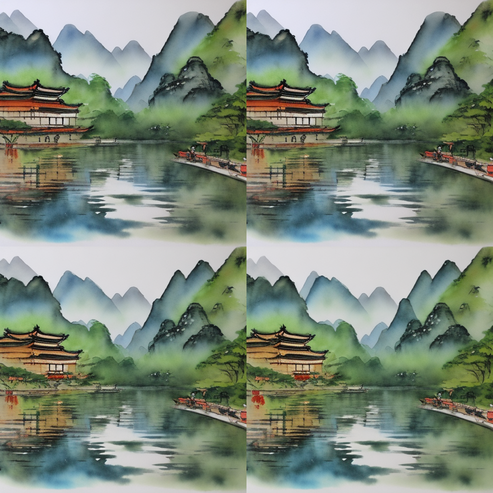

# Optimized stable diffusion for 8gb of vram

Mixes most current available huggingface checkpoints into one program that is accesible from the command line and doesnt have a huge amount of dependencies

Supports up to sd 2.1, including depth checkpoints, textual inversion, inference and evolution.
```
usage: Optimized Stable diffusion [-h] -t TYPE [-p PROMPT] [-i IMAGE] [-m MASK] [-w WIDTH] [-k HEIGHT] 
        [-r ROWS] [-c COLUMNS] [-n INFERENCE] [-o OUT]


options:
  -h, --help            show this help message and exit
  -t TYPE, --type TYPE  accepts options [gen, inpaint, depth, upscale]
  -p PROMPT, --prompt PROMPT
                        Textual prompt, used for diffusion
  -i IMAGE, --image IMAGE
                        Image
  -m MASK, --mask MASK  mask
  -w WIDTH, --width WIDTH
                        width of image
  -k HEIGHT, --height HEIGHT
                        height of image
  -r ROWS, --rows ROWS  rows
  -c COLUMNS, --columns COLUMNS
                        columns
  -n INFERENCE, --inference INFERENCE
                        number of inferences used
  -o OUT, --out OUT     output path

```

# Example output:


